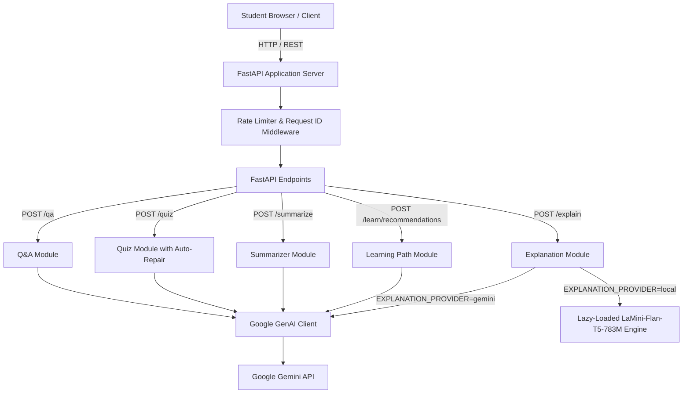

# EduGenie — Google Gemini Powered Learning Assistant

EduGenie is an intelligent academic companion designed to help students master challenging concepts, test their knowledge, condense extensive reading materials, and organize structured learning paths.

Built with **FastAPI**, **Jinja2**, **Vanilla JavaScript/CSS**, and powered by the official **Google GenAI Python SDK** (with an offline **Hugging Face Transformers** local explanation fallback).

---

## 🌟 Core Features

1. **💬 Ask a Question (`POST /qa`)**
   - Answers academic questions with tailored explanations matched to the student's comprehension level (*Beginner*, *Intermediate*, *Advanced*).
   - Generates bulleted key takeaways and illustrative real-world examples.
   - Acknowledges uncertainty directly rather than hallucinating facts.

2. **💡 Explain a Concept (`POST /explain`)**
   - Explains complex topics in plain language with intuitive analogies and concise takeaways.
   - Supports dual inference providers via `EXPLANATION_PROVIDER`:
     - **`gemini`**: Cloud AI via Google Gemini models.
     - **`local`**: Offline local transformer model (`MBZUAI/LaMini-Flan-T5-783M`).
   - Explicitly displays the generation provider on results.

3. **📝 Interactive Practice Quiz (`POST /quiz`)**
   - Generates exactly 3 multiple-choice questions from any topic or study passage.
   - Enforces 4 distinct choices per question, a valid answer index, and a rationale explanation.
   - Includes automatic model repair retries to guarantee valid quiz structure.
   - Frontend provides interactive radio selection, instant scoring out of 3, accessible color & icon indicators, rationale breakdowns, and a "Retry Quiz" option.

4. **📄 Content Summarization (`POST /summarize`)**
   - Condenses educational texts while faithfully preserving essential facts, definitions, and arguments.
   - Supports custom output lengths (*Short*, *Medium*, *Detailed*) and formats (*Paragraphs*, *Bullet Points*).
   - Displays original vs. summary word counts and percentage reduction.

5. **🗺️ Personalized Learning Path (`POST /learn/recommendations`)**
   - Creates a structured week-by-week curriculum based on the learner's goal, current level, daily study budget, and target duration (1–12 weeks).
   - Includes prerequisites, weekly focus concepts, practice activities, milestone self-checks, a capstone project, and suggested study topics.

---

## 🛠️ Technology Stack

| Layer | Technology | Details |
|---|---|---|
| **Backend Framework** | [FastAPI](https://fastapi.tiangolo.com/) | High-performance Python async web framework |
| **Server** | [Uvicorn](https://www.uvicorn.org/) | Lightning-fast ASGI web server |
| **Templates** | [Jinja2](https://palletsprojects.com/p/jinja/) | Server-rendered HTML templates |
| **AI Cloud Integration** | [Google GenAI SDK](https://github.com/googleapis/python-genai) (`google-genai`) | Official maintained SDK for Gemini models |
| **Local Model Fallback** | [Hugging Face Transformers](https://huggingface.co/) | `MBZUAI/LaMini-Flan-T5-783M` seq2seq model |
| **Validation** | [Pydantic v2](https://docs.pydantic.dev/) & `pydantic-settings` | Strict request/response schema validation |
| **Frontend** | Semantic HTML5, Custom CSS, Vanilla JS | Zero bulky frameworks, accessible, mobile-responsive |
| **Testing** | [pytest](https://docs.pytest.org/) | Comprehensive test suite with mocked providers |

---

## 🏗️ Architecture & Request Flow



---

## 📁 Folder Structure

```
EduGenie/
├── main.py                  # FastAPI application entrypoint, middleware, and route handlers
├── config.py                # Environment configuration using pydantic-settings
├── schemas.py               # Pydantic request, response, and quiz validation schemas
├── ai_client.py             # Centralized Google GenAI SDK wrapper and error translation
├── qna.py                   # Academic Q&A feature logic
├── explanation_module.py    # Concept explanation engine (Gemini + Local LaMini support)
├── quiz_module.py           # 3-Question quiz generator with validation and repair retry
├── summary_module.py        # Educational text summarizer with word count analytics
├── learning_path.py         # Week-by-week personalized curriculum generator
├── templates/
│   └── index.html           # Accessible single-page web interface
├── static/
│   ├── style.css            # Custom responsive CSS design system
│   └── app.js               # Dynamic tab switcher, quiz engine, copy/download logic
├── tests/
│   ├── conftest.py          # Pytest fixtures and client configuration
│   ├── test_general.py      # Health check, index route, and error handler tests
│   ├── test_qa.py           # Q&A module tests
│   ├── test_explain.py      # Explanation provider switching tests
│   ├── test_quiz.py         # Quiz 3-question validation and repair tests
│   ├── test_summary.py      # Summarization limits and word count tests
│   ├── test_learning_path.py# Curriculum schedule and duration boundary tests
│   └── test_edge_cases.py   # Quota, auth error, and missing dependency tests
├── requirements.txt         # Core production dependencies
├── requirements-local.txt   # Optional dependencies for offline local Hugging Face model
├── requirements-dev.txt     # Testing and development dependencies
├── .env.example             # Documented template for environment variables
├── .gitignore               # Excludes secrets, caches, and virtual environments
└── README.md                # Project documentation and demo guide
```

---

## ⚙️ Installation & Setup

### Prerequisites
- **Python 3.10, 3.11, or 3.12** installed on your system.

---

### Step 1: Clone or Navigate to the Workspace
```powershell
cd d:\EduGenie
```

---

### Step 2: Create and Activate a Virtual Environment

#### On Windows (PowerShell):
```powershell
python -m venv venv
.\venv\Scripts\Activate.ps1
```

#### On macOS / Linux:
```bash
python3 -m venv venv
source venv/bin/activate
```

---

### Step 3: Install Dependencies

#### Standard Setup (Google Gemini Cloud):
```powershell
pip install -r requirements.txt
```

#### Optional: Local Model Support (Offline Hugging Face Inference):
If you want to run local explanations using `MBZUAI/LaMini-Flan-T5-783M`:
```powershell
pip install -r requirements-local.txt
```

#### Development & Testing Suite:
```powershell
pip install -r requirements-dev.txt
```

---

### Step 4: Configure Environment Variables

1. Copy `.env.example` to create `.env`:
   ```powershell
   copy .env.example .env      # Windows PowerShell
   cp .env.example .env        # macOS / Linux
   ```

2. Open `.env` in a text editor and add your **Google Gemini API Key**:
   ```ini
   GEMINI_API_KEY=your_actual_gemini_api_key_here
   GEMINI_MODEL=gemini-2.5-flash
   EXPLANATION_PROVIDER=gemini
   ```

#### How to Obtain a Free Gemini API Key:
1. Visit [Google AI Studio](https://aistudio.google.com/).
2. Sign in with your Google Account.
3. Click **"Get API key"** and create a new key.
4. Paste the key into your `.env` file for `GEMINI_API_KEY`.

---

## ⚙️ Environment Variables Reference

| Variable | Default Value | Description |
|---|---|---|
| `GEMINI_API_KEY` | *(empty)* | Secret API key from Google AI Studio. Never exposed to browser. |
| `GEMINI_MODEL` | `gemini-2.5-flash` | Configurable model identifier (`gemini-2.5-flash`, `gemini-2.0-flash`, `gemini-1.5-flash`). |
| `EXPLANATION_PROVIDER` | `gemini` | Explanation engine: `gemini` (cloud) or `local` (offline transformer). |
| `LOCAL_MODEL_ID` | `MBZUAI/LaMini-Flan-T5-783M` | Hugging Face model repository used when `EXPLANATION_PROVIDER=local`. |
| `REQUEST_TIMEOUT_SECONDS`| `30.0` | Timeout threshold for AI provider requests. |
| `RATE_LIMIT_PER_MINUTE` | `60` | In-memory sliding rate limiter per client IP. |

---

## 🚀 Running the Application

Start the development server with live reload:

```powershell
python -m uvicorn main:app --reload
```

Once running, access the services at:
- **🌐 Web Interface**: [http://127.0.0.1:8000](http://127.0.0.1:8000)
- **📖 Interactive API Docs (Swagger UI)**: [http://127.0.0.1:8000/docs](http://127.0.0.1:8000/docs)
- **🩺 Diagnostic Health Check**: [http://127.0.0.1:8000/health](http://127.0.0.1:8000/health)

---

## 🧪 Running the Test Suite

EduGenie includes 20 comprehensive automated unit, schema validation, and mocked integration tests:

```powershell
python -m pytest tests/ -v
```

All tests execute with mocked provider calls to verify end-to-end routing without consuming Gemini API quota.

---

## 🎓 College Review & Project Demo Walkthrough

When presenting EduGenie during a project review, follow this 5-step demonstration sequence:

```
┌────────────────────────────────────────────────────────────────────────┐
│                   EduGenie Project Review Sequence                     │
├────────────────────────────────────────────────────────────────────────┤
│ 1. Ask a Question      -> "Which is the largest ocean?" (Intermediate) │
│ 2. Concept Breakdown   -> "Pythagorean theorem" (Beginner)             │
│ 3. Practice Quiz       -> "Photosynthesis" -> Attempt & Review Score   │
│ 4. Text Summarizer     -> Input lecture excerpt -> Review word stats   │
│ 5. Learning Curriculum -> "Python for Data Science" -> 4-Week Roadmap  │
└────────────────────────────────────────────────────────────────────────┘
```

1. **Ask a Question Module (`/qa`)**:
   - Click the **"Try an example"** button to load the question: *"Which is the largest ocean on Earth...?"*.
   - Click **Generate Answer** to show the structured response, bulleted takeaways, and example card.
   - Explain how prompt engineering calibrates depth to Beginner, Intermediate, or Advanced learners.

2. **Explain a Concept Module (`/explain`)**:
   - Switch to the **Explain Concept** tab.
   - Highlight the **Provider Badge** (*Google Gemini* or *Local LaMini*).
   - Demonstrate how analogies and key takeaways make complex concepts memorable.

3. **Practice Quiz Engine (`/quiz`)**:
   - Generate a quiz on *Photosynthesis*.
   - Attempt the 3 questions interactively.
   - Submit answers to demonstrate deterministic score calculation (e.g., `3 / 3 (100%)`), accessible visual feedback (green/red borders and labels), and rationale disclosures.
   - Demonstrate the **"Retry This Quiz"** workflow.

4. **Educational Summarizer (`/summarize`)**:
   - Paste a textbook passage.
   - Select **Medium** length and **Structured Paragraphs**.
   - Show the dynamic word count counter and percentage reduction badge.

5. **Personalized Learning Path (`/learn/recommendations`)**:
   - Input subject *Python for Data Science* with a 4-week timeline.
   - Showcase the generated weekly schedule with focus concepts, hands-on activities, self-check milestones, capstone project, and suggested resource search topics.
   - Click **"Download .txt"** to export the entire learning plan as an offline study guide.

---

## ⚠️ Known Limitations & Disclaimers

1. **Pretrained Inference Only**: EduGenie uses pretrained foundation models (`gemini-2.5-flash` and `LaMini-Flan-T5-783M`) for zero-shot and few-shot inference. It does not fine-tune or train weights locally.
2. **AI Verification**: AI-generated responses, while strictly validated, are educational recommendations and should be verified against primary course materials.
3. **API Quota & Costs**: Google Gemini API usage is subject to Google Cloud's rate limits and quota tiers. A free tier is available via Google AI Studio.
4. **Local Model Hardware**: Running `MBZUAI/LaMini-Flan-T5-783M` locally requires ~3 GB of free RAM and initial internet access to download model weights (~3.1 GB).
